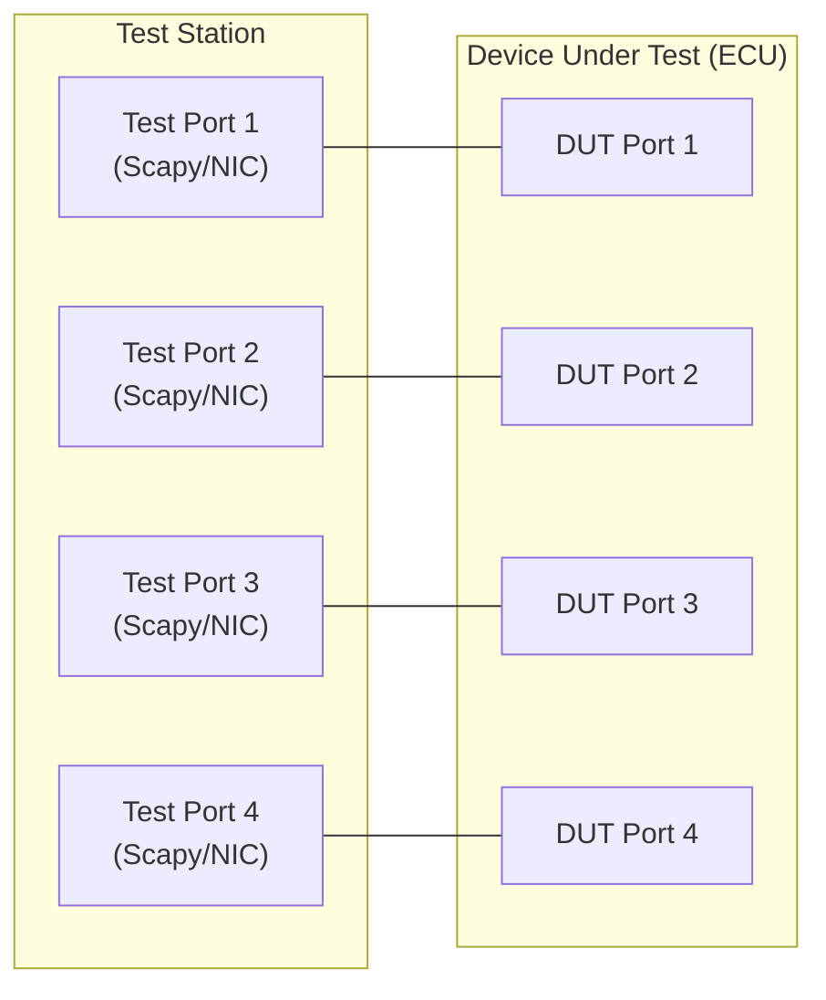
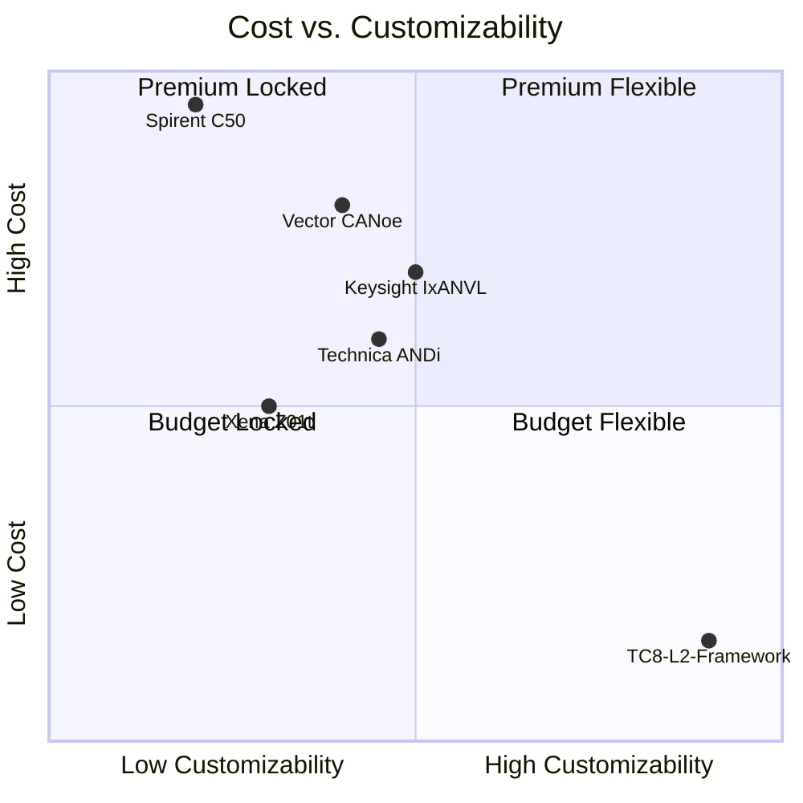
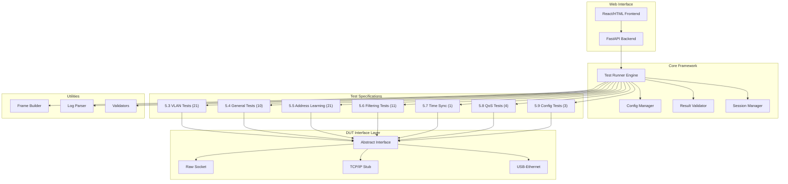
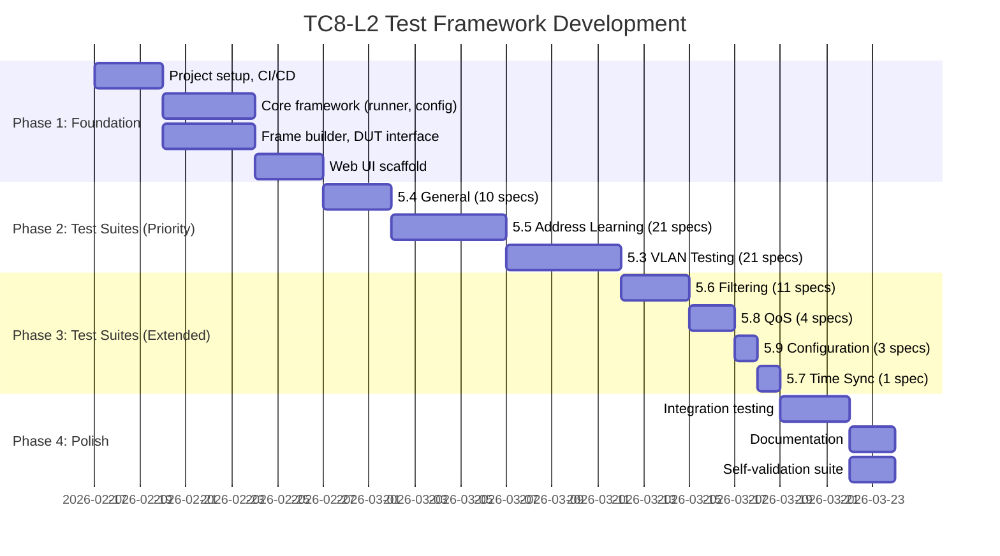

# TC8 Layer 2 Automotive Ethernet ECU Test Framework — Project Requirements Document

> **Document Version:** 1.0  
> **Date:** 2026-02-13  
> **Standard Reference:** OPEN Alliance Automotive Ethernet ECU Test Specification — Layer 2, v3.0  
> **Classification:** Internal / Engineering

---

## 1. Executive Summary

### 1.1 Purpose

This document defines the requirements for building an **open-architecture, Python-based test framework** ("TC8-L2-Test-Framework") that implements the 71 test specifications defined in the **OPEN Alliance TC8 Automotive Ethernet ECU Test Specification — Layer 2, version 3.0**. The framework will validate Layer 2 switching behavior of automotive Ethernet ECUs, covering VLAN tagging, address learning, frame filtering, QoS, time synchronization, and configuration.

### 1.2 Problem Statement

Automotive OEMs and Tier-1 suppliers must validate that their ECU Ethernet switches conform to OPEN Alliance TC8 Layer 2 requirements before integration into vehicle networks. Current solutions from established vendors (Vector, Spirent, Keysight) are:

- **Prohibitively expensive** — €50,000–€200,000+ per test station
- **Closed-source** — limited customization for OEM-specific requirements
- **Vendor-locked** — tied to specific hardware/software ecosystems
- **Opaque** — test logic is often a black box, making debugging difficult

### 1.3 Proposed Solution

A **modular, open-source test framework** built on Python + Scapy that:

| Attribute | Value |
|---|---|
| **Cost** | 5–10× lower than commercial alternatives |
| **Customization** | Full source code access, OEM-specific extensions |
| **Transparency** | Every test case has traceable logic to TC8 spec clauses |
| **Scalability** | From smoke tests (1 hour) to full regression (40+ hours) |
| **Interface** | Web-based UI + CLI + CI/CD pipeline integration |

### 1.4 Target Users

| Role | Needs |
|---|---|
| **ECU Test Engineers** | Execute TC8 Layer 2 tests, analyze results |
| **Switch Integration Engineers** | Validate switch configuration before ECU delivery |
| **Quality Managers** | Generate compliance reports for OEM audits |
| **CI/CD Pipelines** | Automated regression testing on firmware changes |

---

## 2. Standards & Regulatory Context

### 2.1 Primary Standard

**OPEN Alliance Automotive Ethernet ECU Test Specification — Layer 2, v3.0** (May 2020, updated May 2024)

- Published by OPEN Alliance SIG (Special Interest Group)
- Defines conformance tests for Ethernet switching in automotive ECUs
- Covers IEEE 802.1Q VLAN tagging, MAC address learning, frame filtering, QoS
- Referenced by major OEMs (BMW, Daimler, VW Group, Hyundai, Ford, GM, Toyota)

### 2.2 Related Standards

| Standard | Relevance |
|---|---|
| IEEE 802.1Q | VLAN tagging, priority code point (PCP) |
| IEEE 802.3 | Ethernet frame format, MAC addressing |
| IEEE 802.1AS (gPTP) | Time synchronization (Section 5.7) |
| AUTOSAR Testability Protocol | DUT configuration interface |
| OPEN Alliance TC8 Layer 1 | Physical layer (PHY) compliance — prerequisite |
| OPEN Alliance TC11 | Switch semiconductor test specification |

### 2.3 OEM-Specific Extensions

> [!IMPORTANT]
> The framework must support OEM-specific test profiles that extend TC8 requirements. Major OEMs layer their own VLAN policies, QoS mappings, and filtering rules on top of the base TC8 specification.

---

## 3. Test Specification Coverage Analysis

### 3.1 Specification Breakdown (71 Total)

| Section | Topic | Spec Count | Test Case Multiplier | Estimated Cases |
|---|---|---|---|---|
| 5.3 | VLAN Testing | 21 | High (ports × VIDs × frame types) | ~100,000+ |
| 5.4 | General | 10 | Medium (ports × protocols) | ~5,000+ |
| 5.5 | Address Learning | 21 | High (ports × MACs × aging) | ~80,000+ |
| 5.6 | Filtering | 11 | Medium (ports × filter rules) | ~20,000+ |
| 5.7 | Time Synchronization | 1 | Low (timing precision) | ~100+ |
| 5.8 | Quality of Service | 4 | Medium (priority levels × ports) | ~5,000+ |
| 5.9 | Configuration | 3 | Low (startup modes) | ~500+ |
| **Total** | | **71** | | **~200,000–500,000+** |

### 3.2 Test Case Derivation Factors

Each specification generates multiple test cases based on combinatorial factors:

```
Test Cases = f(DUT_Ports, VID_Range, Frame_Types, TPID_Values, Protocol_Types)
```

| Factor | Values | Impact |
|---|---|---|
| **DUT Ports** | 2–8+ per ECU | Ingress × Egress combinations |
| **VID Range** | 0–4095 | 4,096 possible VLAN IDs |
| **Frame Types** | Untagged, Single-tagged, Double-tagged | ×3 multiplier |
| **TPID Values** | 0x8100, 0x88a8, 0x9100 | ×3 multiplier |
| **Protocol Types** | ICMP, ARP | ×2 multiplier |

**Example for 4-port DUT, one VLAN spec:**
`4 ingress × 3 egress × 4,096 VIDs × 3 frame types = ~147,456 test cases`

### 3.3 Test Setup Topologies

#### 5.2.1 Standard Switching Test Setup



- Each test port connects directly to a DUT port via 100BASE-T1 or 1000BASE-T1
- Test station controls all traffic generation and analysis
- No intermediate switches or hubs

#### 5.2.2 Triggered Time Measurement Setup

- Adds hardware triggering for microsecond-precision measurements
- Required for Section 5.7 (Time Sync) and timing-sensitive tests in 5.4

### 3.4 Detailed Section Mapping

#### Section 5.3 — VLAN Testing (21 Specifications)

Tests VLAN tag handling, forwarding, and filtering across the switch:

| ID | Test Focus | Key Validation |
|---|---|---|
| SWITCH_VLAN_001–005 | VLAN membership | Frames forwarded only to member ports |
| SWITCH_VLAN_006–010 | Tag insertion/removal | Correct tagging on egress |
| SWITCH_VLAN_011–015 | PVID assignment | Default VLAN for untagged frames |
| SWITCH_VLAN_016–018 | Double-tagged handling | S-VLAN + C-VLAN processing |
| SWITCH_VLAN_019–021 | VLAN filtering | Drop frames for non-member VLANs |

#### Section 5.4 — General (10 Specifications)

| ID | Test Focus | Key Validation |
|---|---|---|
| SWITCH_GEN_001–003 | Basic forwarding | Unicast, multicast, broadcast |
| SWITCH_GEN_004–005 | Frame size limits | Min/max frame handling |
| SWITCH_GEN_006–007 | Error handling | Malformed frame response |
| SWITCH_GEN_008 | Startup behavior | Switch initialization timing |
| SWITCH_GEN_009–010 | Link state | Port up/down transitions |

#### Section 5.5 — Address Learning (21 Specifications)

| ID | Test Focus | Key Validation |
|---|---|---|
| SWITCH_ADDR_001–005 | MAC learning | Source MAC → port binding |
| SWITCH_ADDR_006–010 | Aging | MAC entry timeout behavior |
| SWITCH_ADDR_011–015 | Flooding | Unknown unicast flooding |
| SWITCH_ADDR_016–018 | Table capacity | MAC table overflow handling |
| SWITCH_ADDR_019–021 | Static entries | Manually configured MACs |

#### Section 5.6 — Filtering (11 Specifications)

| ID | Test Focus | Key Validation |
|---|---|---|
| SWITCH_FILT_001–004 | MAC filtering | Block/allow specific addresses |
| SWITCH_FILT_005–007 | Multicast filtering | Multicast group management |
| SWITCH_FILT_008–009 | Broadcast storm | Rate limiting for broadcasts |
| SWITCH_FILT_010–011 | Protocol filtering | EtherType-based filtering |

#### Section 5.7 — Time Synchronization (1 Specification)

| ID | Test Focus | Key Validation |
|---|---|---|
| SWITCH_TIME_001 | Timestamp accuracy | gPTP residence time correction |

#### Section 5.8 — Quality of Service (4 Specifications)

| ID | Test Focus | Key Validation |
|---|---|---|
| SWITCH_QOS_001–002 | Priority mapping | PCP → queue mapping |
| SWITCH_QOS_003 | Traffic shaping | Bandwidth allocation |
| SWITCH_QOS_004 | Queue scheduling | Strict priority / WRR |

#### Section 5.9 — Configuration (3 Specifications)

| ID | Test Focus | Key Validation |
|---|---|---|
| SWITCH_CFG_001 | Default config | Factory default validation |
| SWITCH_CFG_002 | Config persistence | Survive power cycle |
| SWITCH_CFG_003 | Config interface | AUTOSAR testability protocol |

---

## 4. Competitive Landscape Analysis

### 4.1 Market Overview

The automotive Ethernet testing market is dominated by a small number of established vendors. The following table summarizes the competitive landscape:

| Vendor | Product | Layer Coverage | Approach | Est. Cost | Strengths | Weaknesses |
|---|---|---|---|---|---|---|
| **Vector** | CANoe .Ethernet + vTESTstudio | L1–L7 | SW + HW ecosystem | €50K–€150K+ | Industry standard, AUTOSAR integration, open test source code | Expensive, vendor lock-in, CANoe dependency |
| **Spirent** (now VIAVI/Keysight) | C1/C50 + TTworkbench | L2–L7 | HW appliance + SW | €80K–€200K+ | Purpose-built hardware, comprehensive L2–L7 | Highest cost, being acquired/consolidated |
| **Keysight** (Ixia) | IxANVL + IxNetwork | L1–L7 | SW + oscilloscopes | €3K–€9K/license (SW only) | IxANVL wrote ~90% of TC8 TCP/IP tests, flexible licensing | Primarily L1/L3+, limited L2 switching focus |
| **Technica Engineering** | ANDi ETS + MediaGateway | L1–L3 | HW + SW bundle | €30K–€80K+ | OEM-specific extensions, "Golden Device" reference | Smaller ecosystem, limited community |
| **RUETZ System Solutions** | Automotive Ethernet Tester (AET) | L2 + AVB/TSN | Automated system | €40K–€100K+ | Highly automated, component-level focus | Niche, limited flexibility |
| **Xena Networks** | Z01t Odin | L2–L3 | HW traffic gen/analyzer | €20K–€50K+ | Native 100/1000BASE-T1, RFC 2889 | Hardware-centric, limited automation |
| **Aukua Systems** | MGA8410 | L1–L3 | 3-in-1 tool | €15K–€40K+ | Traffic gen + analyzer + impairment | Smaller vendor, limited TC8 coverage |
| **C&S Group** | Custom test services | L1–L7 | Service + tools | Per-project | Full TC8 service coverage | Service model, not a product |
| **Ostinato** | Open-source traffic gen | L2–L3 | Open-source SW | Free + support | Low cost, basic L2 testing | No TC8 spec mapping, manual |

### 4.2 Competitive Positioning of TC8-L2-Test-Framework



### 4.3 Key Differentiators (Our Framework)

| Differentiator | Commercial Tools | TC8-L2-Test-Framework |
|---|---|---|
| **Cost** | €50K–€200K+ per station | < €5K (NIC hardware + development) |
| **Source Code Access** | Limited / black-box | Full open source |
| **OEM Customization** | Requires vendor support contracts | Direct code modification |
| **CI/CD Integration** | Limited or plugin-based | Native Python/pytest integration |
| **Test Traceability** | Vendor-defined mapping | Direct 1:1 TC8 clause tracing |
| **Deployment** | Dedicated hardware/stations | Any Linux/Windows PC with NICs |
| **Learning Curve** | Proprietary tools (CANoe, TTworkbench) | Standard Python/Scapy ecosystem |

### 4.4 Competitive Risks

> [!WARNING]
> **Key risks from competitors:**
> - Vector's CANoe is the de-facto automotive industry standard — OEM engineers already know it
> - Spirent/Keysight have validated hardware with proven microsecond timing
> - Commercial tools come with vendor support and certification evidence
> - Some OEMs may require "certified" test tools for compliance audits

**Mitigation:** Position framework as a complementary development/CI tool, not a replacement for certification-grade equipment. Target teams needing rapid iteration, cost-sensitive programs, and in-house customization.

---

## 5. Technical Architecture Requirements

### 5.1 System Architecture



### 5.2 Project Directory Structure

```
tc8-l2-test-framework/
├── src/
│   ├── core/                       # Core framework engine
│   │   ├── __init__.py
│   │   ├── test_runner.py          # Test execution engine with parallel support
│   │   ├── config_manager.py       # Config & questionnaire handling (YAML-based)
│   │   ├── result_validator.py     # Pass/Fail analysis with tolerance ranges
│   │   └── session_manager.py      # DUT state isolation between tests
│   │
│   ├── specs/                      # Test specifications (data-driven)
│   │   ├── __init__.py
│   │   ├── base_spec.py            # Abstract base specification class
│   │   ├── vlan_tests.py           # 5.3 VLAN Testing (21 specs)
│   │   ├── general_tests.py        # 5.4 General (10 specs)
│   │   ├── address_tests.py        # 5.5 Address Learning (21 specs)
│   │   ├── filtering_tests.py      # 5.6 Filtering (11 specs)
│   │   ├── time_tests.py           # 5.7 Time Sync (1 spec)
│   │   ├── qos_tests.py            # 5.8 QoS (4 specs)
│   │   └── config_tests.py         # 5.9 Configuration (3 specs)
│   │
│   ├── interface/                  # DUT communication interfaces (pluggable)
│   │   ├── __init__.py
│   │   ├── base_interface.py       # Abstract interface class
│   │   ├── raw_socket.py           # Raw Ethernet socket (Linux AF_PACKET)
│   │   ├── scapy_interface.py      # Scapy-based send/receive
│   │   ├── tcp_interface.py        # TCP/IP stub for remote DUTs
│   │   └── usb_interface.py        # USB-Ethernet adapter interface
│   │
│   ├── utils/                      # Shared utilities
│   │   ├── __init__.py
│   │   ├── frame_builder.py        # Ethernet frame construction (802.1Q, 802.1ad)
│   │   ├── log_parser.py           # Log capture, parsing, and formatting
│   │   ├── validators.py           # Common validation helpers
│   │   ├── timing.py               # High-resolution timing utilities
│   │   └── sampling.py             # Smart test case sampling (edge + representative)
│   │
│   └── models/                     # Data models
│       ├── __init__.py
│       ├── test_case.py            # Test case definition model
│       ├── test_result.py          # Test result model
│       ├── dut_profile.py          # DUT configuration profile
│       └── report.py               # Report data model
│
├── web/                            # Web UI
│   ├── frontend/                   # React/HTML frontend
│   │   ├── index.html
│   │   ├── src/
│   │   └── public/
│   ├── backend/                    # FastAPI backend
│   │   ├── __init__.py
│   │   ├── main.py                 # FastAPI application entry
│   │   ├── routes/                 # API route handlers
│   │   └── websocket.py            # Real-time test progress via WebSocket
│   └── static/                     # CSS/JS assets
│
├── config/
│   ├── questionnaire.yaml          # ECU team questionnaire template
│   ├── defaults.yaml               # Default test assumptions
│   ├── dut_profiles/               # DUT-specific configuration profiles
│   │   └── example_ecu.yaml
│   └── test_tiers.yaml             # Tiered test scope definitions
│
├── data/
│   ├── spec_definitions/           # TC8 spec definitions (YAML/JSON, version-controlled)
│   │   ├── vlan_specs.yaml
│   │   ├── general_specs.yaml
│   │   ├── address_specs.yaml
│   │   ├── filtering_specs.yaml
│   │   ├── time_specs.yaml
│   │   ├── qos_specs.yaml
│   │   └── config_specs.yaml
│   └── golden_reference/           # Known-good test results for self-validation
│
├── tests/                          # Framework self-tests
│   ├── unit/                       # Unit tests for all modules
│   ├── integration/                # Integration tests with mock DUT
│   └── self_validation/            # Framework validates itself
│
├── reports/                        # Generated test reports
│   ├── templates/                  # Report templates (HTML, PDF, CSV)
│   └── archives/                   # Historical test results
│
├── docs/                           # Documentation
│   ├── user_manual.md              # How to run tests
│   ├── developer_guide.md          # How to add new specs
│   ├── configuration_reference.md  # All config options
│   ├── troubleshooting.md          # Common issues and solutions
│   └── api_reference.md            # REST API documentation
│
├── scripts/                        # Helper scripts
│   ├── setup_environment.sh        # Environment setup
│   ├── pre_test_validation.py      # Link and cable diagnostics
│   └── generate_report.py          # Standalone report generation
│
├── requirements.txt                # Python dependencies
├── pyproject.toml                  # Project metadata and build config
├── Dockerfile                      # Container deployment
├── docker-compose.yml              # Multi-container setup
├── .github/
│   └── workflows/
│       └── ci.yml                  # GitHub Actions CI/CD pipeline
└── README.md                       # Project overview
```

### 5.3 Technology Stack

| Layer | Technology | Justification |
|---|---|---|
| **Language** | Python 3.10+ | Automotive industry adoption, Scapy ecosystem, rapid development |
| **Packet Engine** | Scapy 2.5+ | De-facto standard for packet crafting, automotive protocol support |
| **Test Framework** | pytest | Industry-standard Python testing, excellent CI/CD integration |
| **Web Backend** | FastAPI | Async support, auto-generated API docs, WebSocket support |
| **Web Frontend** | React or vanilla HTML/JS | Interactive test management UI |
| **Configuration** | YAML + Pydantic | Human-readable configs with strict validation |
| **Reporting** | Jinja2 + WeasyPrint | HTML/PDF report generation |
| **Database** | SQLite (dev) / PostgreSQL (prod) | Historical results storage and trend analysis |
| **Containerization** | Docker | Reproducible test environments |
| **CI/CD** | GitHub Actions / Jenkins | Automated regression pipelines |

### 5.4 Hardware Requirements

| Component | Specification | Purpose |
|---|---|---|
| **Test PC** | x86_64, 8+ GB RAM, Linux (preferred) | Test execution host |
| **Network Interfaces** | 2–8× Ethernet NICs (one per DUT port) | Direct connection to DUT |
| **NIC Type** | Intel i210/i350 (hardware timestamping) OR 100/1000BASE-T1 adapters | Timing precision and automotive PHY |
| **Cables** | 100BASE-T1 / 1000BASE-T1 compliant cables | DUT connection |
| **Optional: GPS/PPS** | PPS signal source for gPTP tests | Section 5.7 timing reference |

> [!NOTE]
> For 100BASE-T1/1000BASE-T1 connections, media converters or specialized NICs (e.g., Microchip LAN8670, Marvell 88Q2112 evaluation boards) may be required between standard Ethernet NICs and automotive PHY interfaces.

### 5.5 Software Requirements

| Dependency | Version | Purpose |
|---|---|---|
| Python | ≥ 3.10 | Runtime |
| Scapy | ≥ 2.5 | Packet crafting/analysis |
| pytest | ≥ 7.0 | Test execution |
| FastAPI | ≥ 0.100 | Web API backend |
| Pydantic | ≥ 2.0 | Data validation |
| PyYAML | ≥ 6.0 | Configuration parsing |
| Jinja2 | ≥ 3.1 | Report templating |
| SQLAlchemy | ≥ 2.0 | Database ORM |
| uvicorn | ≥ 0.20 | ASGI server |
| psutil | ≥ 5.9 | System resource monitoring |

---

## 6. Key Architectural Decisions

### 6.1 Data-Driven Test Specifications

> [!IMPORTANT]
> Test specifications MUST be defined in YAML/JSON, not hardcoded in Python. This ensures:
> - Version-controlled spec evolution (v3.0 → future v4.0)
> - Easy addition of OEM-specific extensions
> - Separation of test logic from test data

**Example spec definition:**

```yaml
# data/spec_definitions/vlan_specs.yaml
SWITCH_VLAN_001:
  tc8_reference: "5.3.1"
  title: "VLAN Membership Verification"
  description: "Verify frames are forwarded only to ports that are members of the VLAN"
  parameters:
    vid_range: [1, 4095]
    frame_types: [untagged, single_tagged, double_tagged]
    tpid_values: [0x8100, 0x88a8, 0x9100]
  preconditions:
    - "DUT ports configured with known VLAN membership"
    - "MAC address table cleared"
  test_procedure:
    - "Send tagged frame with VID=X on ingress port"
    - "Verify frame received on all member ports"
    - "Verify frame NOT received on non-member ports"
  expected_result:
    forward_to: "member_ports_only"
    tag_action: "as_configured"
  timing_tolerance_ms: 100
  priority: high
```

### 6.2 Test Session Manager (State Isolation)

Every test MUST execute within a managed session that handles cleanup:

```python
class TestSession:
    """Manages DUT state isolation between tests."""
    
    async def setup(self):
        """Pre-test: Verify DUT in known state."""
        await self.clear_mac_table()
        await self.reset_statistics()
        await self.verify_link_state()
        await self.verify_vlan_config()
    
    async def teardown(self):
        """Post-test: Reset DUT state."""
        await self.clear_mac_table()
        await self.reset_statistics()
        await self.wait_for_aging(timeout=30)
```

### 6.3 Tiered Test Execution

```yaml
# config/test_tiers.yaml
tiers:
  smoke:
    description: "Quick validation — 1 hour"
    specs: [SWITCH_GEN_001, SWITCH_GEN_002, SWITCH_GEN_003]
    vid_sampling: [1, 100, 4094]        # 3 VIDs only
    port_sampling: "first_pair"          # 1 ingress × 1 egress
    
  core:
    description: "Core functionality — 8 hours"
    specs: "all_5.4 + all_5.5 + all_5.3"  # 52 specs
    vid_sampling: [0, 1, 100, 1000, 4094, 4095]  # 6 representative VIDs
    port_sampling: "all_pairs"
    
  full:
    description: "Full regression — 40+ hours"
    specs: "all"                          # All 71 specs
    vid_sampling: "all"                   # 0–4095
    port_sampling: "all_combinations"
```

### 6.4 DUT Configuration Strategy

**Phase 1 (MVP):** Pre-configured DUT — assume ECU team has configured the DUT. Framework validates behavior matches documented configuration.

**Phase 2 (Future):** Configuration interface via AUTOSAR Testability Protocol or UDS diagnostic sequences.

**Phase 3 (Future):** Auto-discovery of DUT configuration through probing.

### 6.5 Timing Architecture

| Timing Tier | Accuracy | Method | Use Cases |
|---|---|---|---|
| **Tier A** | ±1ms | Python `time.perf_counter()` | Frame forwarding, basic latency |
| **Tier B** | ±100µs | NIC hardware timestamps (SO_TIMESTAMPING) | Aging timers, startup timing |
| **Tier C** | ±1µs | External hardware (PPS, GPS) + C extension | gPTP, precise residence time |

> [!CAUTION]
> Framework will clearly document timing accuracy level for every test result. Tests requiring Tier C accuracy that only achieve Tier A will be flagged as **"informational — timing limitation"**, not pass/fail.

---

## 7. Risk Analysis & Mitigations

### 7.1 Risk Register

| # | Risk | Severity | Likelihood | Impact | Mitigation |
|---|---|---|---|---|---|
| R1 | **Python timing non-determinism** — OS scheduling and GIL prevent µs-level precision | CRITICAL | High | Timing-sensitive tests (5.4.3, 5.5.6, 5.7.1) may produce unreliable results | Document timing limitations; use NIC HW timestamps; optional C extension for critical paths |
| R2 | **Test state pollution** — MAC table, VLAN state persists between tests | CRITICAL | High | False positives/negatives in subsequent tests | Session Manager with mandatory cleanup; wait for aging; verify clean state before each test |
| R3 | **DUT configuration opacity** — Switch config hardcoded in firmware, not accessible | HIGH | High | Cannot validate configuration requirements (5.9) | Start with pre-configured DUT (Option A); design for AUTOSAR Testability Protocol later |
| R4 | **Physical layer instability** — Link flaps, cable quality issues | HIGH | Medium | Results invalidated by L1 issues, not L2 bugs | Pre-test link validation; continuous link monitoring; cable diagnostics |
| R5 | **Test flakiness** — Non-deterministic flooding, aging, rate limiting | MEDIUM | High | Inconsistent results reduce confidence | Statistical pass criteria; multiple runs; "informational" classification for known-flaky tests |
| R6 | **Scale — 500K+ test cases** — Full suite takes 40+ hours | MEDIUM | Certain | Impractical for daily runs | Tiered execution (smoke/core/full); smart VID sampling; parallel port testing |
| R7 | **100BASE-T1 PHY availability** — Standard NICs don't support automotive PHY | MEDIUM | High | Cannot connect to automotive ECU ports | Use media converters; support specialized evaluation boards; abstract interface layer |
| R8 | **OEM acceptance** — May require "certified" tools for compliance audit | MEDIUM | Medium | Framework rejected for official compliance | Position as development/CI tool; provide full test traceability to TC8 clauses |
| R9 | **Spec evolution** — TC8 v4.0 may change requirements | LOW | Medium | Tests become outdated | Data-driven spec definitions (YAML); version-controlled; backward compatibility |
| R10 | **Framework correctness** — How to validate the validator? | MEDIUM | Medium | Incorrect pass/fail decisions | Golden reference tests; self-validation suite; negative tests; peer review |

### 7.2 Timing Accuracy Decision Matrix

| Test Section | Required Accuracy | Achievable (Python) | Gap | Action |
|---|---|---|---|---|
| 5.3 VLAN | ±100ms | ±1ms | None | ✅ Python adequate |
| 5.4 General | ±10ms (startup) | ±1ms | None | ✅ Python adequate |
| 5.5 Address Learning | ±1s (aging) | ±1ms | None | ✅ Python adequate |
| 5.6 Filtering | ±100ms | ±1ms | None | ✅ Python adequate |
| 5.7 Time Sync | ±1µs | ±1ms | **~1000×** | ⚠️ Requires HW timestamps or C extension |
| 5.8 QoS | ±10ms | ±1ms | None | ✅ Python adequate |
| 5.9 Configuration | ±1s | ±1ms | None | ✅ Python adequate |

**Conclusion:** Only Section 5.7 (Time Synchronization) has a critical timing gap that requires hardware assistance.

---

## 8. Implementation Plan & Timeline

### 8.1 Development Phases



### 8.2 Phase Details

| Phase | Duration | Deliverables | Priority |
|---|---|---|---|
| **Phase 1: Foundation** | Week 1–2 | Project setup, core engine, frame builder, DUT interface, web scaffold | 🔴 Critical |
| **Phase 2: Priority Test Suites** | Week 3–5 | 5.4 General (10), 5.5 Address Learning (21), 5.3 VLAN (21) — 52 specs | 🔴 Critical |
| **Phase 3: Extended Test Suites** | Week 6–7 | 5.6 Filtering (11), 5.8 QoS (4), 5.9 Config (3), 5.7 Time Sync (1) — 19 specs | 🟡 High |
| **Phase 4: Integration & Docs** | Week 8–10 | Integration tests, documentation, self-validation, CI/CD pipeline | 🟡 High |

### 8.3 Test Suite Priority Rationale

| Priority | Specs | Rationale |
|---|---|---|
| **1. General (5.4)** | 10 | Foundation — validates basic switch operation before complex tests |
| **2. Address Learning (5.5)** | 21 | Core switching intelligence — MAC learning affects all other test outcomes |
| **3. VLAN (5.3)** | 21 | Most common automotive requirement — every vehicle network uses VLANs |
| **4. Filtering (5.6)** | 11 | Security-relevant — increasingly important for automotive cybersecurity |
| **5. QoS (5.8)** | 4 | Critical for ADAS/AD — priority traffic must be deterministic |
| **6. Configuration (5.9)** | 3 | DUT-dependent — requires configuration interface |
| **7. Time Sync (5.7)** | 1 | Hardware-dependent — requires specialized NIC or equipment |

---

## 9. Quality & Validation Strategy

### 9.1 Framework Self-Validation

Before testing any DUT, the framework must validate itself:

| Validation | Method | Frequency |
|---|---|---|
| **Loopback test** | Send frame → loopback → verify reception | Every test session start |
| **Frame integrity** | Generate frame → serialize → deserialize → compare | Unit test (CI) |
| **Timing calibration** | Measure round-trip time to known reference | Every test session start |
| **Config validation** | Parse DUT profile → validate against schema | Before every test run |

### 9.2 Test Result Classification

| Classification | Meaning | Action |
|---|---|---|
| **PASS** | DUT behavior matches TC8 specification | No action |
| **FAIL** | DUT behavior deviates from TC8 specification | Investigate / report defect |
| **INFORMATIONAL** | Test ran but result is subject to known limitations (e.g., timing) | Review manually |
| **SKIP** | Test not applicable to DUT configuration | Document reason |
| **ERROR** | Test framework error (not DUT issue) | Fix framework |

### 9.3 Reporting Requirements

| Report Type | Format | Content |
|---|---|---|
| **Summary** | HTML / PDF | Pass/Fail counts, per-section breakdown, overall compliance % |
| **Detailed** | HTML / PDF / CSV | Every test case with inputs, expected vs. actual, timestamps |
| **Traceability** | CSV / Excel | 1:1 mapping from test case → TC8 clause → result |
| **Trend** | HTML (charts) | Historical pass rates, regression detection |
| **CI/CD** | JUnit XML | Machine-readable for pipeline integration |

---

## 10. Open Questions for Stakeholders

> [!IMPORTANT]
> The following questions must be resolved before implementation begins. Answers will significantly impact architecture decisions.

| # | Question | Impact | Options |
|---|---|---|---|
| Q1 | **Do you have physical access to the DUT Ethernet ports?** Or is this for simulation/planning only? | Determines if we build for real hardware or simulation first | A) Physical DUT available → real interface; B) Planning only → mock DUT first |
| Q2 | **How precise do timing measurements need to be?** ±1ms? ±10ms? ±100ms? | Technology choice — Python only vs. C extension vs. hardware timestamping | A) ±10ms (Python OK); B) ±1ms (NIC timestamps); C) ±1µs (hardware required) |
| Q3 | **How often will the full test suite run?** Daily? Weekly? Per firmware release? | Infrastructure sizing, test tier design | A) Daily (need 1-hour smoke tier); B) Weekly (8-hour core tier); C) Per release (40+ hour full) |
| Q4 | **Can the DUT be power-cycled or reset between tests?** | Critical for state isolation strategy | A) Yes → full reset between tests; B) No → must wait for natural aging |
| Q5 | **Does the DUT support simultaneous traffic on multiple ports?** | Determines if parallel test execution is feasible | A) Yes → parallel execution; B) No → sequential only |
| Q6 | **Any existing test tools/scripts to integrate with or replace?** | Avoid duplication, leverage existing work | A) None; B) Existing scripts → import; C) Existing tools → interface |
| Q7 | **What NIC hardware is available?** Standard Ethernet? 100BASE-T1 adapters? | Interface implementation priority | A) Standard NICs + media converters; B) Automotive PHY NICs |
| Q8 | **Target OS for test station?** Linux (recommended), Windows, or both? | Socket implementation, timing precision | A) Linux only; B) Windows only; C) Both (more development effort) |

---

## 11. Success Criteria

| Metric | Target | Measurement |
|---|---|---|
| **Spec Coverage** | 100% of 71 TC8 L2 specs implemented | Traceability matrix |
| **Test Execution** | Smoke tier < 1 hour, full tier < 48 hours | Test run duration |
| **Reliability** | < 1% framework-caused errors | Error rate over 100 runs |
| **Timing Accuracy** | ≤ ±10ms for non-timing tests, documented for timing tests | Calibration results |
| **Report Quality** | OEM-auditable reports with TC8 clause tracing | Stakeholder review |
| **CI/CD Ready** | Tests execute in headless mode with JUnit XML output | Pipeline integration |
| **Documentation** | User manual, developer guide, API reference complete | Doc review |

---

## 12. Glossary

| Term | Definition |
|---|---|
| **DUT** | Device Under Test — the automotive ECU being validated |
| **TC8** | Technical Committee 8 of the OPEN Alliance SIG |
| **VID** | VLAN Identifier (0–4095) |
| **PCP** | Priority Code Point — 3-bit field in 802.1Q tag |
| **TPID** | Tag Protocol Identifier (0x8100 for C-VLAN, 0x88a8 for S-VLAN) |
| **gPTP** | Generalized Precision Time Protocol (IEEE 802.1AS) |
| **PHY** | Physical Layer transceiver (100BASE-T1, 1000BASE-T1) |
| **PVID** | Port VLAN Identifier — default VID for untagged frames |
| **AUTOSAR** | AUTomotive Open System ARchitecture |
| **UDS** | Unified Diagnostic Services (ISO 14229) |
| **DoIP** | Diagnostics over Internet Protocol |
| **TSN** | Time-Sensitive Networking (IEEE 802.1) |
| **WRR** | Weighted Round Robin — QoS scheduling algorithm |

---

*Document prepared by: TC8-L2 Test Framework Engineering Team*  
*Reference: OPEN Alliance Automotive Ethernet ECU Test Specification — Layer 2, v3.0*
